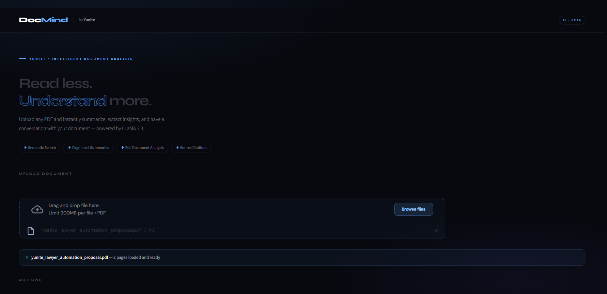

# DocMind AI — by Yunite



> Upload any PDF and instantly summarize, extract insights, and have a conversation with your document — powered by LLaMA 3.3 via Groq.

---

## Features

- **Semantic Search** — finds relevant content across the entire document
- **Page-level Summaries** — summarize any individual page instantly
- **Full Document Summary** — structured summary with Purpose, Scope, Financials, Timeline and more
- **Chat with PDF** — ask questions in plain English, get cited answers with page references
- **Source Citations** — every answer tells you exactly which page it came from

---

## Tech Stack

| Layer | Technology |
|---|---|
| UI | Streamlit |
| LLM | LLaMA 3.3 70B via Groq API |
| Embeddings | sentence-transformers (all-MiniLM-L6-v2) |
| Vector Search | FAISS |
| PDF Parsing | pypdf |

---

## Setup

**1. Clone the repo**
```bash
git clone https://github.com/atifkhan78666/docmind-ai.git
cd docmind-ai
```

**2. Install dependencies**
```bash
pip install -r requirements.txt
```

**3. Add your Groq API key**

Create a `.env` file in the root folder:
```
GROQ_API_KEY=your_key_here
```
Get a free key at [console.groq.com](https://console.groq.com)

**4. Run the app**
```bash
streamlit run app.py
```

---

## Project Structure
```
docmind-ai/
├── app.py            # Streamlit UI
├── llm.py            # Groq LLM integration
├── rag.py            # Vector store + RAG chat
├── pdf_utils.py      # PDF loading and chunking
├── requirements.txt  # Dependencies
└── .env              # API key (not committed)
```

---

## Built by Yunite
